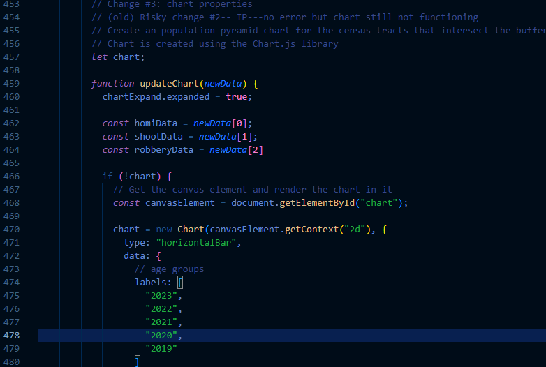

# Objective 
Getting the below ArcGIS SDK JavaScript sample to work with selected data from group project. (Too stubborn to give up)

Documentation of the sample
```
https://developers.arcgis.com/javascript/latest/sample-code/layers-scenelayerview-query-stats/
```

# Method
Using the neighborhood crime data statistics; data fieldd: the rates of homicide, shooting, and robbery (per 100,000 population).
Rest endpoint URL
```
https://services.arcgis.com/S9th0jAJ7bqgIRjw/ArcGIS/rest/services/Neighbourhood_Crime_Rates_Open_Data/FeatureServer/0
```

# Results
Building on experience obtained from failures in the previous week, finally able to get it to work with major steps detailed in the following.

# Major steps
0) Basic configurations 
1) Change query data (statdefinitions)
2) Change information returned
3) Change chart output


## 0) Basic configurations
Building on the basis of the last attempt (sample_test2.html) and the sample code, with major changes being the loading of the targeted feature layer (by url or id), the zoom, the center, and constraints of scale.


## 1) Change query data (statDefinitions)
This section outlines the inspiration leading to the solution and actual steps employed.

### Inspiration 
Going through the original sample, the part of the code responsible for extracting the statistical fields from the data is identified (Figure 1), further cross-checked by the field names in the original sample from the rest endpoint URL (Figure 2) and the use of the code in conducting the client-side spatial query (Figure 3).\
\
Figure 1
\
Figure 2
```
https://services2.arcgis.com/FiaPA4ga0iQKduv3/ArcGIS/rest/services/US_Census_Age_Gender/FeatureServer/3
```
\
Figure 3

### Actual steps
The goal is to feed the right data into the list of statDefinitions. 

#### Redefine statDefinitions according to the target field names
\
Construct new PopupStats and push them to the statDefinitions based on target data fields


## 2) Change information returned
Pretty straightforward here: changing the data storage for the chart, and loop through the values by referencing the updated field names, where using equal or key.includes should work well.

### Original sample


### Modified


### Outcome
For the first time, the data is finally loading! The figures are responsive to the varying buffer size.\


### Next step
Work on the chart 


## 3) Change chart output
At this point, only the use of the external library for the chart matters as the SDK (query geometry) portion is functioning. The major changes are changing the properties of the labels, datasets, and output data. 

### Original sample


### Example of modification 


### Outstanding issue 

All data are plotted on a single column.

### Attempt to solve the outstanding issue and discoveries
After changing the stacked property to false, another issue emerges:

The gist of the issue is that following the original sample (aiming to make as few changes as possible to avoid breaking things) requires multiple fields of categorized data. In the original sample, the category was male and female, with the multiple fields being the different age groups. Therefore, to replicate the functioning sample, the query of the target data should also be on multiple fields of categorized data, instead of only one field which failed here. This requires restarting over from Step 1 but the steps are largely the same as above.


## Restarting over again
Starting from the basic configurations again, the data structure of the original sample is replicated and the other steps are mostly the same.

### Reworking on 1) query data (statDefinitions)


### 2) Change information returned
No modifications needed apart from the above changes.

### 3) Change chart properties
\
Again, referencing the updated data and changing the labels.

### Output
Link to working example
```
https://ymanluk.github.io/scratchspace/week11/workingSDK.html
```


MOM!! I MADE IT!!!!


# Next Steps
Inform groupmates and further discuss the possibilities.

# Next Steps--Update (19th March)
Will continue explore the SDK as agreed by groupmates.


