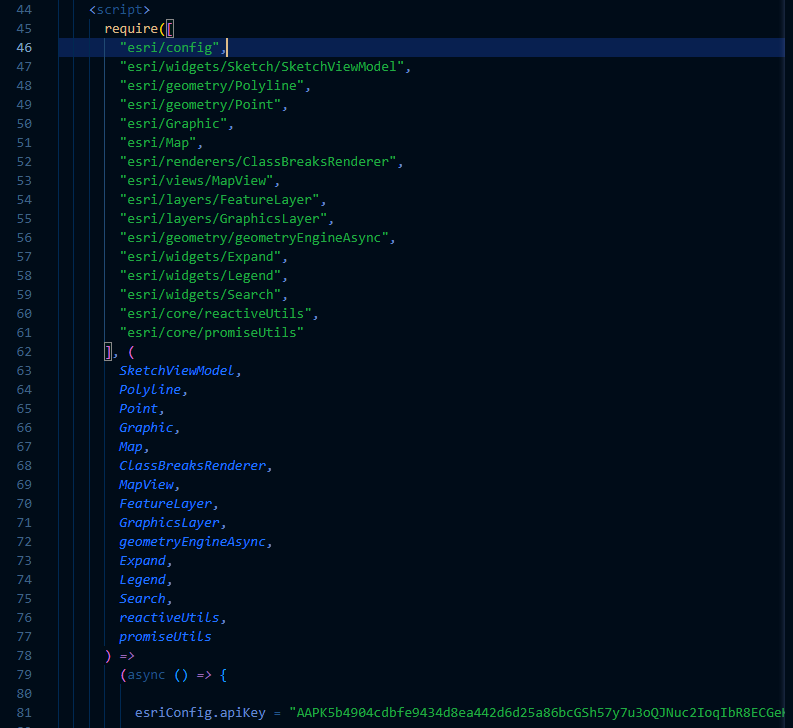
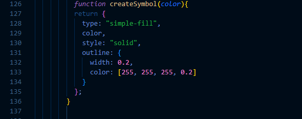
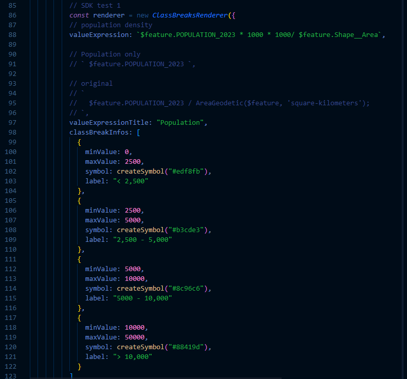
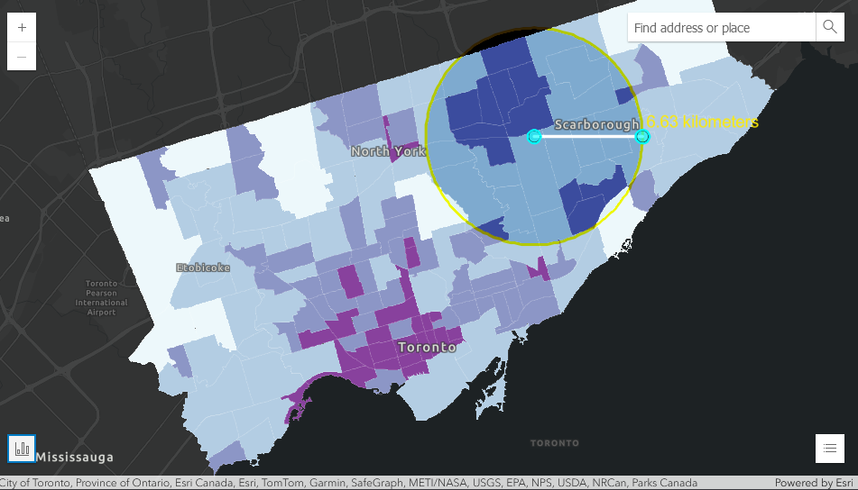
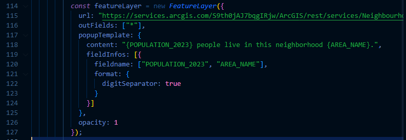

# Cartographic enhancement

## Testing out class breaks in SDK
Sample:
```
https://developers.arcgis.com/javascript/latest/visualization/data-driven-styles/class-breaks/
```

### Setting up the scene
- Adding API key
- Libraries and calling them (esriconfig, ClassBreaksRenderer)
- Relevant function (createSymbol) from the sample
- Making sure variable 'renderer' is defined and called 




### Adjusting the input for renderer and optimizing class values
Since the crime statistics are in rates, population density is used and calculated by dividing population by SHAPE__AREA 
which is converted from square-meters to square-kilometers.



### Output
Successful rendering of the class breaks.



### Further attempt to add a popup template triggered by clicking on a polygon (neighborhood)
Not working, possible reasons include the overlain graphic layer on the feature layer, to be investigated


## Next steps
- Adding legend items for population density
- Investigate why popup template is not working
