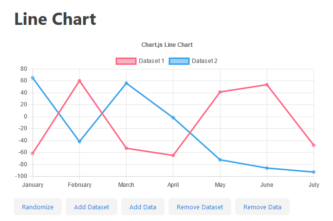
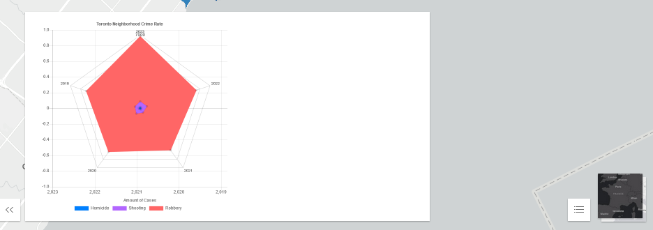
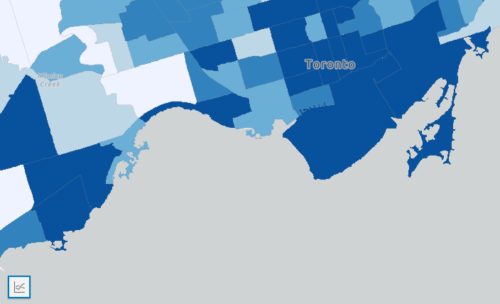
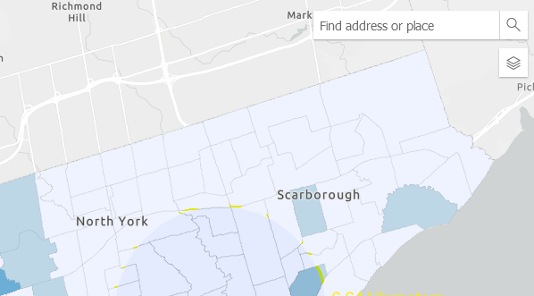
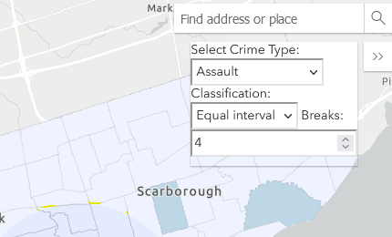
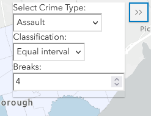
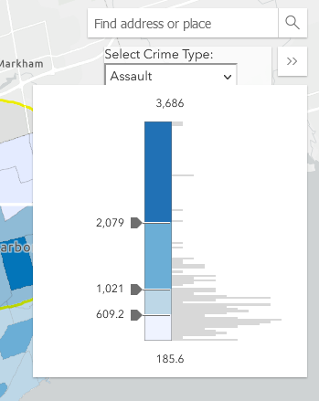
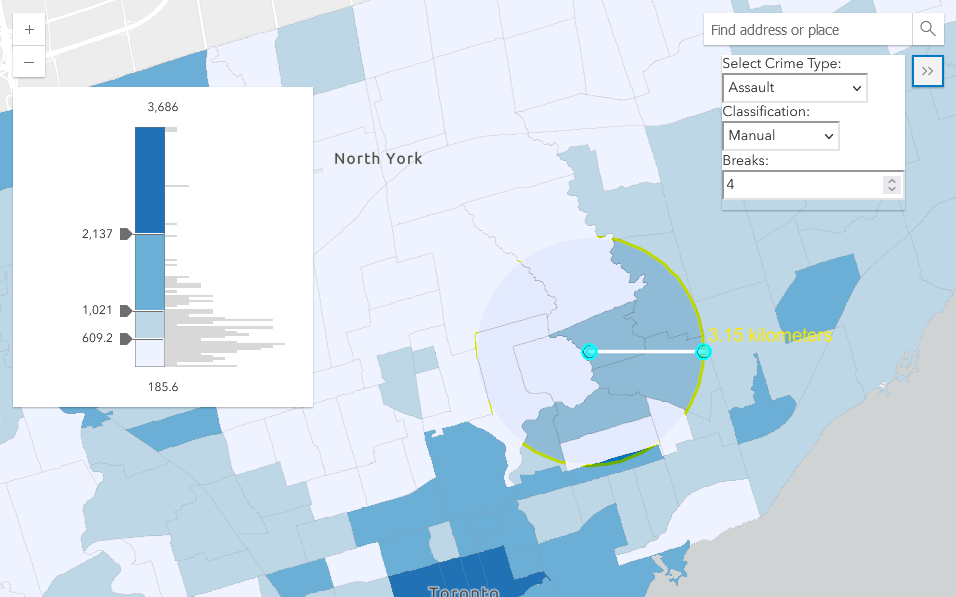
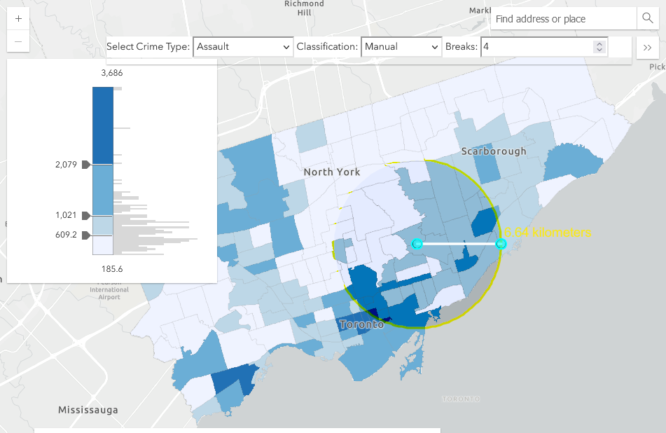

# Objective 
Building upon the second SDK enhancement for class breaks selection, perform general enhancement/optimization 
on the SDK, particularly the UI.


# Method
Start by evaluating alternative chart formats to existing bar charts, then setting up icons to access functionalities,
troubleshooting in the process. 


# Results
Largely successful.
```
https://ymanluk.github.io/scratchspace/week12/SDK_e3.html
```

# Major steps
0) Explore Alternative Chart Formats
1) Setting up icons to access functionalities
2) Results


## 0) Explore Alternative Chart Formats

### Rationale
Find the bar chart a bit difficult to navigate while observing a line chart which might be decent to show trend
in the external library documentation.

### Line Chart attempt
Step: As simple as changing the expandIcon property.

Outcome: not looking good; problem with data input; more importantly problem with different crime rate data ranges.

Next steps: try out another chart format
### RADAR chart attempt
Step: same as above

Outcome: Also not looking good; same problem with data input; ultimately not appropriate to show trend but a snapshot.
Next steps: Just keep the existing bar charts, they look fine now


## 1) Modification/Combination of the code
This section outlines the major issues encountered and respective solutions in combining the codes together.

### Rationale
Whilst working on the charts, noticed that the tiny icon (on the bottom left of the image below)
 for the chart is useful and aesthetic, should be used systematically across other functionalities 


### General workflow
- Set up the view ui icon
- Set up the expand variable (crimeExpand)
- Add to UI display
- Set the infoDiv to expand when clicking the icon

### Troubleshooting
This section documents the troubleshooting pattern of how one fix shows another issue and another fix.
#### Text display in layer selection
It started well with the clickable icon of layer selection. 

Yet the display is not that good. Particularly the placement of the breaks in the same line as the choice for classification.

Optimized the breaks placement by simply making it a div.

#### Placement of Manual class breaks chart
When manual classification is selected, the selection box is covered.

Trying out alernative positions for chart placement but not getting good results.

Trying out stacking the selection box in a single row to make space for the chart: seems feasible.

Then the next step will just be moving the chart back to top right following the selection box/icon.

#### Minor issue: infoDiv showing up when the page initializes 
When the page initializes, the infoDiv shows up momentarily, somewhat affecting user experience.


https://github.com/ymanluk/scratchspace/assets/146376058/044f9f4f-1a53-4251-a677-0ecc4a198a4f


Tried hiding and then display infoDiv but no use.

After some research, tried window.onload but also not working, while not wanting to use jQuery.


At last, all the problem-solving is just commenting out the view ui since the infoDiv is called upon already when selecting manual classification.


## 2) Results
Looks tidy and works smoothly now!

https://github.com/ymanluk/scratchspace/assets/146376058/38c070b7-28a9-4925-96bb-9fd757dffb8c


# Next steps
Continue to enhance the SDK. Perhaps adding more crime data that correspond to the layer selection.


