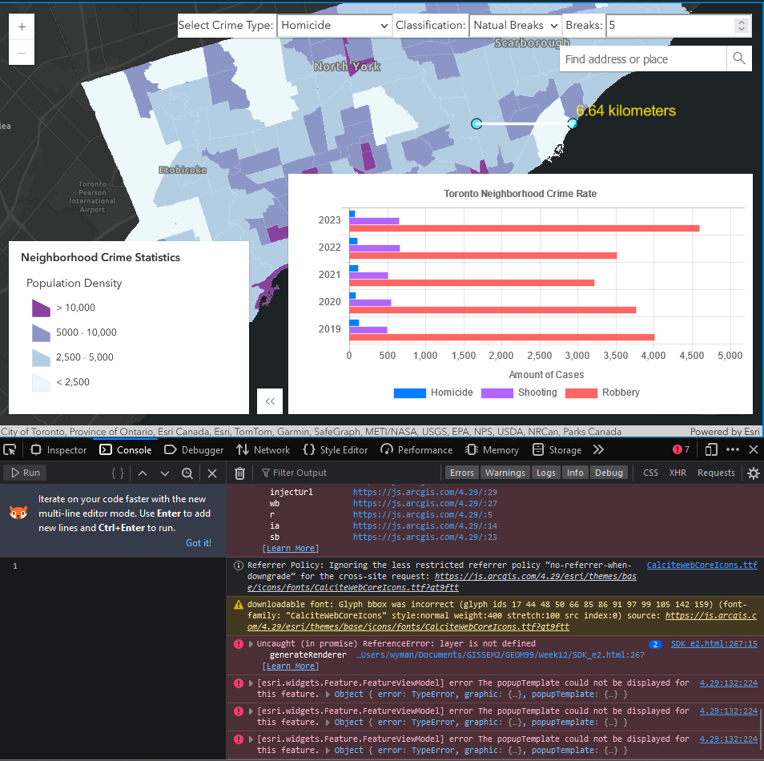

# Objective 
Building upon the first SDK enhancement for simple class breaks, further modify to enable user customization of the class breaks 
options based on the sample below.

Documentation of the sample:
```
https://developers.arcgis.com/javascript/latest/sample-code/visualization-sm-classbreaks/
```

Sample of working class break options for the target datasets:
```
https://cklouislok.github.io/geom99web7/test/colormap.html
```

# Method
Combine the codes together and check for issues; optimize the UI.


# Results
Largely successful and made some changes for better UI.
```
https://ymanluk.github.io/scratchspace/week12/SDK_e2.html
```

# Major steps
0) Going through and understanding how the sample works
1) Modification/Combination of the code
- Loading extra libraries
- Adding generateRenderer function (noting potential performance cost for end user as being warned in the documentation)
- Managing the widgets arrangements
2) Optimization


## 0) Going through and understanding how the sample works
Nothing too complex since the same featureLayer is used, thus no modification needed for that part; Given that simple class breaks
is working (as shown in previous enhancement), the technical difficulty of the implementation is not expected to be high.

## 1) Modification/Combination of the code
This section outlines the major issues encountered and respective solutions in combining the codes together.

### Initial attempt: Broken graphics layer


After combining the codes, the graphics (buffer) layer is broken as it is no longer functioning.
Solution: changing the placement of the codes\
Next steps: look into the layer variable error

### Layer and slider error
After bringing the graphics layer back to life, it is time to deal with the layer definition and also other errors.

Solution: look into codes that reference the layer variable; layer variable should be referenced as featureLayer instead

Issue: Reference error for the ClassedColorSlider
Solution: make sure library and calling are working; typical issue is forgetting there is no comma for the last ite

### Minor issue: chart not showing in the beginning 

Solution: Changing the expand property from True to False; be careful of the choice to expand when initializing/updating the chart

If not careful enough, the Chart would hide when moving/resizing the buffer

### Output
The combined code is functioning without major issues


## 2) Optimization
With additional information displayed, it is important to keep the interface clean yet easy to navigate.

### Optimization 1: keeping only one legend for the class breaks and only show upon click on the icon
As straightforward as removing/commenting out the always-display legend


### Optimization 2: Widget placement 
Solution: Adjusting properties of the view.ui elements. After testing different placements, the current one appears to be the cleanest.

### Very minor issue 
The buffer layer is not very visible in dark vector basemap but no issues in gray vector basemap.
Possible solution: Use gray vector basemap instead; try to reorder the layers; changing the colors


# Next steps
Continue to enhance the SDK.


